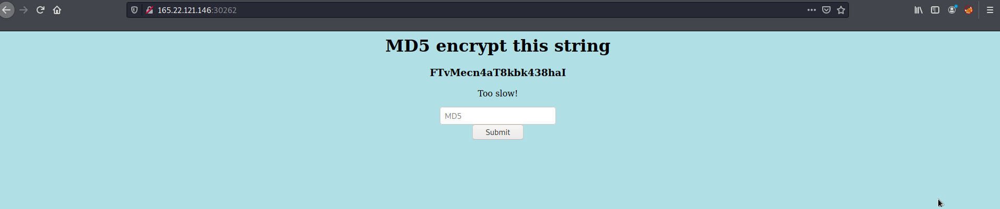

# emdee five for life

## First web challenge on HTB

I noticed the web page had a option to submit a specified string that changes on each connection to md5 hash it

I took a SANS573 and remembered a similar challenge where you needed to submit the string provided back to server in order to answer it correctly.

Thus it took me some time to figure out the [md5.py](https://github.com/tehbooom/CTFs/blob/main/HTB/Challenges/emdee_five_for_life/md5.py) script to display the flag.

I finally got the response but it kept saying i was too slow so i knew i was on the right track

To optimize this script i removed all my print statements from troubleshooting and thus got the flag!
**This is one of my first python scripts ever so be gentle**
