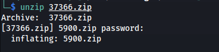
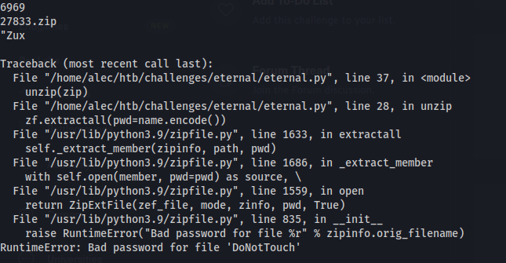
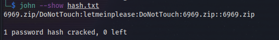
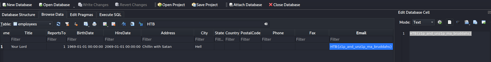

# Eternal Loop

I suck at pentesting so I spent sometime doing some random challenges.
Some are not that hard and others are a little tricky.
This challenge by far was the most interesting and fun for me.

First you are given a file called `37366.zip`

When you go to unzip the file it prompts you for a password in which I did not know obviously.

But as you can see it does show a file `5900.zip`

I tried to unzip the file with the next filename as the password since the challenge is called **Eternal Loop**.

AND IT WORKED!

Now we have another file called 5900.zip however as the challenge is called this could go on forever, thus came a python script.

[eternal.py](https://github.com/tehbooom/CTFs/blob/main/HTB/Challenges/eternal_loop/eternal.py) is my second python script so be gentle however the basic logic of it is:

- strings the file and set it as an arrary
- grab the last element which is always the name of the next file
- set the last element as the filename to unzip next and password for current file

This script will run forever until there is nothing else to unzip or something breaks.

After about 5ish minutes something broke and I thought the new password would be the filename however this one was different.

After trying a bunch of passwords on `6969.zip` I decided to ask my friend john for help.

First I set the file as a hash for john

    zip2john 6969.zip > hash.txt

Then john cracked the password for me!

    john hash.txt --wordlist=/usr/share/wordlists/rockyou.txt

This left a file called `DoNotTouch` which I thought would be the end of it but it turns out to be a sqlite database.

So I opened the database browser for SQLite and searched for strings with HTB and found the flag in the employees table.

All around fun box!
